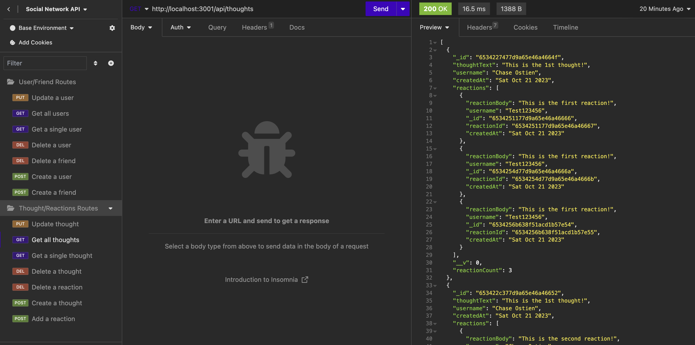

# Social Network API 

## Table of Contents
* [Description](#description)
* [Installation](#installation)
* [Usage](#usage)
* [License](#license)
* [Contributors](#contributors)
* [Tests](#tests)
* [Questions](#questions)

## Description
This application is a social network api designed to allow users to share their thoughts, react to friends thoughts and create a friend list. It uses Express.js for routing, Nodemon for development assistance, a MongoDB database and the Mongoose ODM. It also utilizes the native JavaScript Date object to format timestamps. 

## Installation
To install this application, create a directory in which you will develop your application. Inititalize a `package.json` file by running `npm init -y`. You can then set up your git repo by running `git init` and creating a `.gitignore` file. After ensuring your `package.json` contains all required dependencies, install them by running `npm install` in your root directory. You should see your `node_modules` folder populate in your root directory.

## Usage
To use this application, make sure you have followed all installation instructions and installed the required dependencies. To start the server and run this program, enter `npm start` in your terminal. Alternatively, if you wish restart the server with Nodemon during development and testing, start the server by running the command `npm run dev` in your terminal. Once the server is live, you will be able to use an API tester such as Insomnia or Postman to test the CRUD functionality of your API.

#### Example of a test API call for this application in Insomnia.

#### Video recording of program flow and output. 

## License
ISC License

https://opensource.org/licenses/ISC
## Contributors
This application has no contributors.

## Tests
There are currently no written tests for this application, however, you can test its function by running the program and using an API endpoint tester to hit the routes written in the routes directory.

## Credits
This README file was created using a command line README generator developed by myself and hosted at the GitHub repo below.

https://github.com/ChaseOstien/README_Generator

## Questions
### If you have any questions about this application, please send all correspondence to the contact info listed below. 
* GitHub: ChaseOstien - https://github.com/ChaseOstien
* Email: Chaseostien@gmail.com